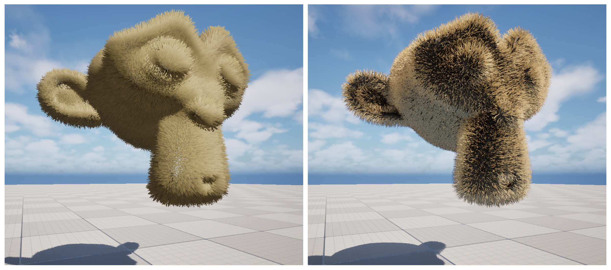

# Scalability of Shell-based and Strand-based Real-Time Fur Rendering in Unreal Engine

> Luke Sakal (szakal-byt3)

Rendering fur has been an ongoing challenge in computer graphics, especially in real-time rendering where efficiency is important. Two broad approaches have emerged -- implicit and explciit rendering. In explicit rendering methods, fur geometry is created per strand of fur. In contrast, implicit methods seek to create the illusion of many strands without explicitly rendering strand geometry. This project uses Unreal Engine's Groom system as a way to create explicit, strand-based fur and a Material-based approach to create implicit, shell-based fur. These are then tested in an attempt to evaluate the scalability of each approach. 

This project implements shell fur via an ActorComponent C++ class and custom Material nodes. The C++ code performs duplication of the Actor's base static mesh. Material nodes handle normal-based extrusion via world position offset (WPO) and provide custom emissive lighting based off the equation described in the paper *Real-Time Fur over Arbitrary Surfaces* by Lengyel et al. There are two variants of the shell fur implementation -- a naive solution which creates and attaches new static meshes to the Actor and a solution which uses an instanced static mesh instead. These implementations are limited to supporting static meshes only, do not support multiple lights, and do not attempt to generate fin geometry.

Unreal's Groom pipeline is used as is. Groom assets and models were created with Blender. Performance metrics for tests are captured with Unreal's CSV Profiler tool, activated through level Blueprints.

___

### Raw Data

Due to size, raw results were not tracked with git. A ZIP file containing them can be downloaded from here: https://csuchico-my.sharepoint.com/:f:/g/personal/lesakal_csuchico_edu/IgBidTZPw7NPRb81ZB7yhVVRAQXqN3tDthe4dg1p--hVM9I?e=2TZuRF

___

### Attributions:

The noise texture used for shell fur density is from Book of Shaders :https://thebookofshaders.com/edit.php?log=161119150756

The following resources helped inform the code:
* https://dl.acm.org/doi/pdf/10.1145/364338.364407 | https://hhoppe.com/fur.pdf
* https://dev.epicgames.com/community/learning/tutorials/vaKW/fortnite-epic-for-indies-unreal-engine-5-6-create-hair-fur-material-with-shell-texturing-step-by-step
* https://www.shadertoy.com/view/XsfSR8

Additional attributions available under the references section of the paper. 

